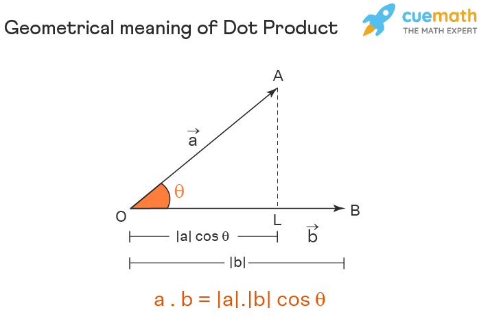

# **Vector Dot Product Implementation**

## **Introduction**  
The _dot product_ is a fundamental operation in linear algebra that takes two vectors and returns a scalar value. This operation is widely used in fields such as:
- Computer graphics
- Machine learning
- Physics.

---

## **Mathematical Expression**  
The dot product of two vectors _A_  and _B_, each of size $\ n \$, is calculated as:

$$\[
\mathbf{A} \cdot \mathbf{B} = \sum_{i=1}^{n} A_i B_i = A_1 B_1 + A_2 B_2 + \cdots + A_n B_n
\]$$

---

## **Code Example**  

Below is a snippet of the implementation in Python:  

```python
def dot_product(vector_a, vector_b):
    if len(vector_a) != len(vector_b):
        raise ValueError("Vectors must be of the same length")
    return sum(a * b for a, b in zip(vector_a, vector_b))

# Example usage
vec_a = [1, 2, 3]
vec_b = [4, 5, 6]
result = dot_product(vec_a, vec_b)
print("Dot product:", result)
```
---
## Here is a diagram elaborating the mathematical equation graphically.



[^1]: this image has been taken from `cuemath.com`.


Here is a list of all what has been included in this readme file:
- [x] Headings
- [x] styling
- [x] text quoting
- [x] lists
- [x] checklists
- [ ] links
- [x] images
- [ ] tables
- [x] footnotes
- [x] mathematical equations
- [x] code
- [ ] alerts


> [!CAUTION]
> Sometimes such critical information may lead to end of the world, so use it responsively.

For more help you can visit [Byju's website](https://byjus.com/)


